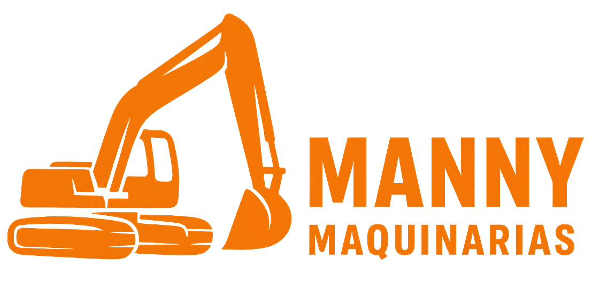

<p align="center">
  </a>
</p>

## Descripcion

Backend en nestjs del proyecto CRUD, **Manny Maquinarias**.

## Caracteristicas

* Envio de mails
* Integracion con mercado pago
* Gestion de imagenes
* Jwt
* Autenticacion por rol

## Requisitos

* Nodejs > 20

## Inicializacion

```bash
git clone https://github.com/facu-carri/Alquileres-Back.git
cd Alquileres-Back
yarn install
```

* Crea una database, en `database.module.ts` cambiar el valor de `initializeDB` a ``true``
* Crear y completar `.env` utilizando `.env.example`
* * [Mercado pago token](https://www.mercadopago.com.ar/developers/es/docs/checkout-pro/overview) (Este proyecto utiliza checkout pro)
  * [Google appplication password](https://myaccount.google.com/apppasswords) (**La cuenta de google debe tener 2fa**)

## Compilar y correr el proyecto

```bash
# development
$ yarn run start

# watch mode
$ yarn run start:dev

# production mode
$ yarn run start:prod
```
